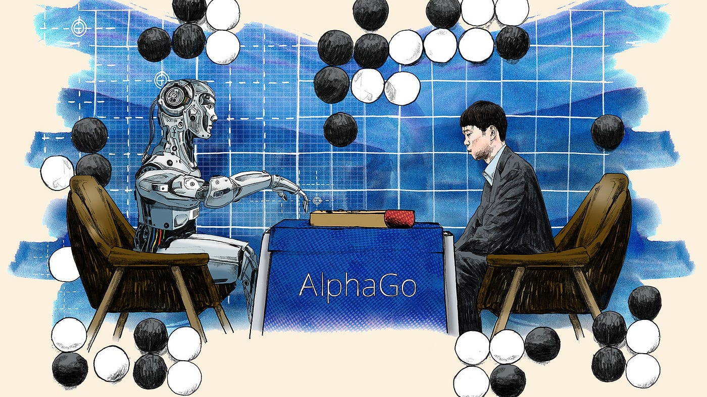

I was once a professional Go player, having started learning it at four and continuing trainning until high school. 
 
Interestingly, back then, Go was considered a game that couldn't be conquered by machines. This belief was partly due to the immense complexity of Go, with the number of possible variations being around 
10^768, which is  similar to 361!
Until...
 
Although humans are still unable to exhaust all the variations, it appears that the "policy network", even with an early stop Monte Carlo tree search, is sufficient...
